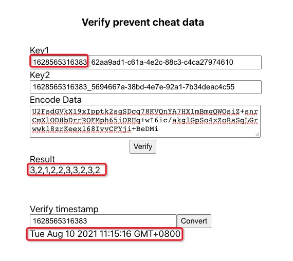

# 
Anti-cheating for betting Mini Apps

The article designed an approach to prevent website from cheating in betting Mini Apps.
It is known that it’s easy for a betting game cheat to players. For example, if you played a dice game, the website could easily control your result(win or lost). To protect players’ interests, this article describes how to prevent these from happening.    

## Arithmetic
Game providers will generate two keys and the result before player start playing. The key is generated with the  current timestamp and uuid. It is easy to identify the timestamp. Game provider will encode the result with two key by AES encrypt method.  

Result---[AES(key1)]--->EncodeResult1---[AES(key2)]--->EncodeResult2  

Game provider will publish key1 and EncodeResult2 to players before the game starts. After the player finishes the game, the game provider will publish key2. Players could use it to verify if the result matches what the provider generated before.

It can NOT for the website to modify EncodeResult2 to change the former Result.

## Example
We play rock-paper-scissors game.  
## Before play
Game provider generate the result and two keys as below:  
result: "2,1,3,3,3,1,3,2,3,3"(1: rock, 2: scissors, 3: paper)  
key1: 1628565316383_62aa9ad1-c61a-4e2c-88c3-c4ca27974610  
key2: 1628565316383_5694667a-38bd-4e7e-92a1-7b34deac4c55   
The EncodeResult2 should be:  
U2FsdGVkX19xIpptk2sgSDcq78KVQnYA7HX1mBmgQWOsiZ+snrCmXlOD8bDrrROFMph65iORHq+wI6ic/akglGpSo4xZoRsSqLGrwwk18zrKeexl68IvvCFYji+BeDMi

In this time, player should be see key1 and EncodeResult2 in the website as below    

## After played

For the scenaro, if you choosed scissors. The game provider can NOT change the result to let you lose the game. because the result alreay given["2,1,3,3,3,1,3,2,3,3"(1: rock, 2: scissors, 3: paper), The first number will match if you play one round with one click].  

Once the game is finished, the player could find key2 in the website to verify the result    

Now the player has two keys and the EncodeResult. Player could fill in these three fields to decode the EncodeResult.  

## Conclusion
The key is that the game provider can't change key2 to change result. If you have other arguments or questions , please let us know. 