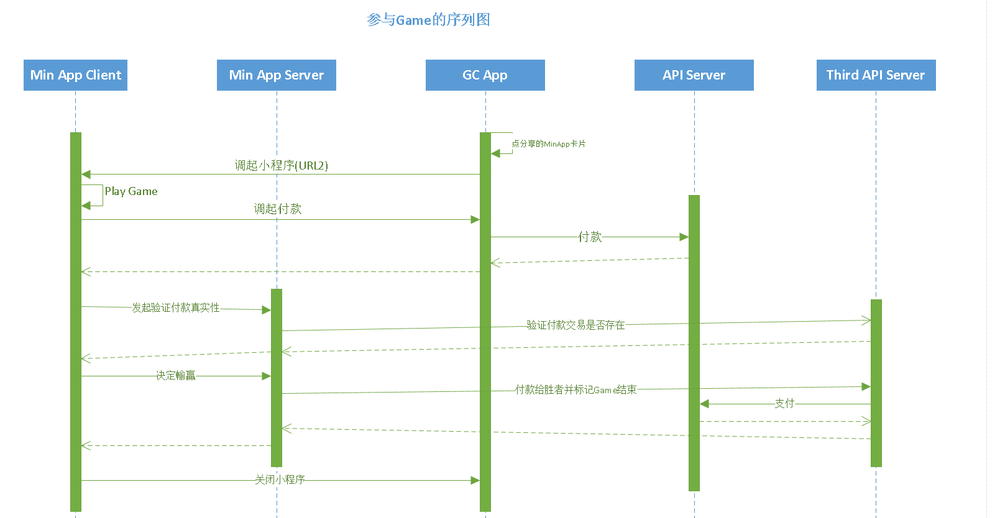

# 
DSD Of Min App User Case

1. 怎样发起Game(两玩家互动)
.png)
2. 怎样参与已有的Game(两玩家互动)

3. 怎样发起付款(单玩家普通的支付)

4. 付款成功后断网，发起Game失败
5. 决定Win/Lost后，后台付款给Winner失败
6. 后台回调付款通知给第三方
7. 发起付款并传递参数给第三方
8. 没有参与者怎样退款(两玩家互动)
9. 怎样防止重复参与(两玩家互动)
10. 竞猜Game防作弊处理
11. 预防黑客攻击
12. Game状态的管理(两玩家互动)  
如果满足以下两个条件时，会要求用户管理状态，即维护状态
- 调用付款接口时有传roundId
- 在新建小程序时有填写在指定时间内如果该盘Game未完成，则会自动退款

13. 怎样防止重复支付  

