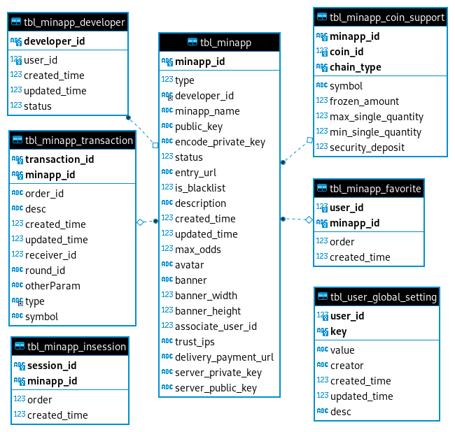

# <center>Database Design</center>
```sql

-- guildbank.transactions 新增字段:
ALTER TABLE guildbank.transactions ADD ext varchar(1000) NULL COMMENT '扩展字段';


-- guildchat.tbl_minapp_developer definition

CREATE TABLE `tbl_minapp_developer` (
  `user_id` bigint(20) NOT NULL COMMENT '用户id',
  `developer_id` varchar(50) NOT NULL COMMENT '开发者id',
  `created_time` bigint(13) DEFAULT NULL,
  `updated_time` bigint(13) DEFAULT NULL,
  `status` tinyint(4) DEFAULT '1' COMMENT '1--正常  0--不正常',
  PRIMARY KEY (`developer_id`),
  UNIQUE KEY `tbl_minapp_developer_user_id_IDX` (`user_id`) USING BTREE
) ENGINE=InnoDB;

-- guildchat.tbl_minapp definition

CREATE TABLE `tbl_minapp` (
  `minapp_id` varchar(50) NOT NULL,
  `type` tinyint(4) DEFAULT NULL COMMENT 'Game - 1  High Risks - 2  Other - 3',
  `developer_id` varchar(50) NOT NULL,
  `minapp_name` varchar(50) DEFAULT NULL COMMENT '该Game的名字',
  `public_key` varchar(500) DEFAULT NULL COMMENT 'App发给game用户的数据时，就是用这个key进行加密',
  `encode_private_key` varchar(3000) DEFAULT NULL COMMENT '通过开发者账号关联的用户的密码加密的privatekey， 支付及服务器调用时必须用private_key进行签名
',
  `status` tinyint(4) DEFAULT NULL COMMENT '1—提交中， 2—审核通过， 3---审核失败 4--禁用',
  `entry_url` varchar(1000) DEFAULT NULL COMMENT '这是Game的入口',
  `is_available` tinyint(4) DEFAULT 1 COMMENT '是否上架 0 - 下架  1 - 上架',
  `description` varchar(100) DEFAULT NULL COMMENT '描述',
  `created_time` bigint(13) DEFAULT NULL,
  `updated_time` bigint(13) DEFAULT NULL,
  `max_odds` decimal(40,20) DEFAULT NULL COMMENT '最大赔率',
  `avatar` varchar(200) DEFAULT NULL COMMENT '小程序的图标',
  `banner` varchar(200) DEFAULT NULL COMMENT '小程序海报url',
  `banner_width` int(11) DEFAULT NULL COMMENT 'banner 宽度',
  `banner_height` int(11) DEFAULT NULL COMMENT 'banner 高度',
  `associate_user_id` bigint(20) DEFAULT NULL COMMENT '关联的用户id， 与小程序关联的特殊用户(不能登录)',
  `trust_ips` varchar(1000) DEFAULT NULL COMMENT '这些IP是被信任的对于provider调用支付时',
  `delivery_payment_url` varchar(1000) DEFAULT NULL COMMENT '支付成功后发送的交易信息',
  `server_private_key` varchar(3000) DEFAULT NULL COMMENT '这个是服务端用于签名的钥，不能分离给外部',
  `server_public_key` varchar(500) DEFAULT NULL COMMENT '公开提供给客户端验证服务端签名的公钥',
  PRIMARY KEY (`minapp_id`),
  KEY `tbl_minapp_developer_id_IDX` (`developer_id`) USING BTREE
) ENGINE=InnoDB;

-- guildchat.tbl_minapp_favour definition

CREATE TABLE `tbl_minapp_favorite` (
  `user_id` bigint(20) NOT NULL COMMENT '用户id',
  `minapp_id` varchar(50) NOT NULL COMMENT ' 小程序id',
  `order` int(11) DEFAULT NULL,
  `created_time` bigint(13) DEFAULT NULL,
  PRIMARY KEY (`user_id`,`minapp_id`)
) ENGINE=InnoDB;

-- guildchat.tbl_minapp_inteam definition

CREATE TABLE `tbl_minapp_insession` (
  `session_id` varchar(50) NOT NULL,
  `minapp_id` varchar(50) NOT NULL,
  `order` int(11) DEFAULT NULL,
  `created_time` bigint(13) DEFAULT NULL,
  PRIMARY KEY (`session_id`,`minapp_id`)
) ENGINE=InnoDB;

-- guildchat.tbl_minapp_transactions definition

CREATE TABLE `tbl_minapp_transaction` (
  `transaction_id` varchar(50) NOT NULL COMMENT '这个是用于第三方转账记录下来的transcation',
  `order_id` varchar(100) CHARACTER SET utf8mb4 COLLATE utf8mb4_0900_ai_ci DEFAULT NULL COMMENT '对应的tbl_coin_pouch_order中的order_id',
  `desc` varchar(100) DEFAULT NULL,
  `created_time` bigint(13) DEFAULT NULL,
  `updated_time` bigint(13) DEFAULT NULL,
  `minapp_id` varchar(50) NOT NULL,
  `receiver_id` bigint(20) DEFAULT NULL COMMENT '接收者Id, 由于在tbl_coin_pouch_order中查不到接收者Id, 所以这个者中加入了接收者Id',
  `round_id` varchar(100) DEFAULT NULL COMMENT '局次ID',
  `otherParam` varchar(1000) DEFAULT NULL COMMENT '这个传给对方的参数 (包括订单号等信息)',
  `type` varchar(20) DEFAULT NULL COMMENT '小程序收款，付款给用户，退款给用户',
  `symbol` varchar(255) DEFAULT NULL,
  `is_user_payment` TINYINT(1) NULL COMMENT '是否为用户付款',
  PRIMARY KEY (`transaction_id`,`minapp_id`),
  KEY `idx_type` (`type`) USING BTREE
) ENGINE=InnoDB;

-- guildchat.tbl_minapp_coin_support definition

CREATE TABLE `tbl_minapp_coin_support` (
  `minapp_id` varchar(50) NOT NULL COMMENT ' 小程序id',
  `coin_id` int(11) unsigned NOT NULL,
  `chain_type` varchar(10) NOT NULL COMMENT '链类型 trx eth 等',
  `symbol` varchar(255) DEFAULT NULL COMMENT 'token 的 symbol, 因为token的symbol是存在bank中，而symbol不会改变，所以做为冗余字段存在数据库中以便提高性能',
  `frozen_amount` decimal(40,20) DEFAULT NULL COMMENT '冻结金额,  玩家在游戏过程中发生的交易的冻结金额',
  `max_single_quantity` decimal(40,20) DEFAULT NULL COMMENT '最大单次付款金额',
  `min_single_quantity` decimal(40,20) DEFAULT NULL COMMENT '最小单次付款金额',
  `security_deposit` decimal(40,20) DEFAULT NULL COMMENT '保证金,  小程序上线之后就需要冻结的金额',
  PRIMARY KEY (`minapp_id`,`coin_id`,`chain_type`)
) ENGINE=InnoDB;

-- guildchat.tbl_user_global_setting definition

CREATE TABLE `tbl_user_global_setting` (
	`user_id` bigint(20) NOT NULL,
	`key` varchar(50) NOT NULL COMMENT '配置键',
	`value` varchar(4000) NULL COMMENT '配置值',
	`creator` varchar(50) NULL,
	`created_time` bigint(20) NULL,
	`updated_time` bigint(20) NULL,
	`desc` varchar(200) NULL,
	PRIMARY KEY (`user_id`,`key`)
) ENGINE=InnoDB;


```


### ER Diagram

